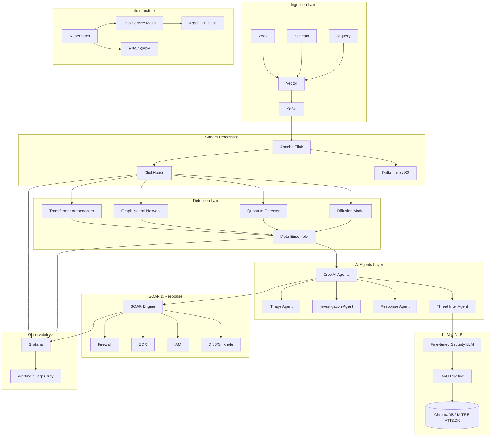

# Cyber Global Shield v2.0 — Analyse Complète & Plan d'Améliorations de Pointe

## 📋 Résumé Exécutif

**Cyber Global Shield v2.0** est une plateforme SIEM autonome impressionnante avec :
- **35+ modules de sécurité** couvrant détection, prévention, réponse et intelligence
- **Pipeline d'ingestion** robuste : Vector → Kafka → ClickHouse
- **ML avancé** : Transformer Autoencoder, GNN, Quantum VAE, Ultra-Detector (12 niveaux)
- **Agents CrewAI** : Triage, Investigation, Response, Threat Intel
- **SOAR Engine** : DAG-based playbooks avec rollback et audit trail
- **Infrastructure cloud-native** : Docker, Helm, Terraform, ArgoCD, CI/CD

---

## ✅ Forces Identifiées

### Architecture & Code
1. **Architecture modulaire** bien organisée (`app/core/`, `app/ml/`, `app/ingestion/`, `app/soar/`, `app/agents/`)
2. **Circuit Breaker pattern** pour Kafka — prévention de cascading failures
3. **Backpressure controller** adaptatif dans le pipeline d'ingestion
4. **Rate limiting** avec Token Bucket (in-memory + Redis)
5. **Security Headers OWASP** complets (CSP, HSTS, X-Frame-Options, etc.)
6. **WebSocket Manager** robuste avec channels, org-level isolation, event history
7. **Structured logging** structlog avec format JSON pour ELK
8. **Retry logic** avec exponential backoff pour DB et ClickHouse
9. **Audit trail immuable** dans le SOAR engine
10. **Tests unitaires** pour les 35 modules de sécurité

### ML & Détection
11. **Transformer Autoencoder** avec attention pour détection d'anomalies
12. **Graph Neural Networks** (GraphSAGE + GAT) pour détection de mouvements latéraux
13. **Quantum Variational Autoencoder** avec PennyLane
14. **Ultra-Detector** avec 4 techniques complémentaires (Isolation Forest Extreme, Deep SVDD, VAE+Flows, Bayesian Ensemble)
15. **Meta-Ensemble** avec Stacking, Bayesian Averaging, Mixture of Experts
16. **Federated Learning** avec Flower + Ray
17. **MLflow tracking** pour expérimentation

### SOAR & Réponse
18. **DAG-based playbooks** avec dépendances entre actions
19. **Rollback capability** pour annulation d'actions
20. **Locking mechanism** pour éviter les conflits d'exécution
21. **Intégrations multiples** : Firewall, EDR, IAM, MISP, Cortex, VirusTotal

---

## ⚠️ Faiblesses & Problèmes Identifiés

### Sécurité & Configuration
| # | Problème | Fichier | Sévérité |
|---|----------|---------|----------|
| 1 | **Default admin password** `cybershield2024` hardcodé | [`config.py`](../Cyber%20Global%20Shield/app/core/config.py:34) | 🔴 Critique |
| 2 | **SECRET_KEY** par défaut `change-me-in-production-use-aws-secrets` | [`config.py`](../Cyber%20Global%20Shield/app/core/config.py:28) | 🔴 Critique |
| 3 | **MISP_VERIFY_SSL=False** par défaut | [`config.py`](../Cyber%20Global%20Shield/app/core/config.py:85) | 🟡 Moyen |
| 4 | **SQLite fallback** en production si Supabase non configuré | [`database.py`](../Cyber%20Global%20Shield/app/core/database.py:27) | 🟡 Moyen |
| 5 | **CORS trop permissif** avec wildcard `*.cyberglobalshield.com` | [`app.py`](../Cyber%20Global%20Shield/app.py:177) | 🟡 Moyen |

### Qualité du Code
| # | Problème | Fichier | Sévérité |
|---|----------|---------|----------|
| 6 | **Mixed logging** : certains modules utilisent `logging` au lieu de `structlog` | [`neural_security_mesh.py`](../Cyber%20Global%20Shield/app/core/neural_security_mesh.py:36), [`active_defense_countermeasures.py`](../Cyber%20Global%20Shield/app/core/active_defense_countermeasures.py:17) | 🟡 Moyen |
| 7 | **Try/except larges** pour imports conditionnels masquent les erreurs | [`neural_security_mesh.py`](../Cyber%20Global%20Shield/app/core/neural_security_mesh.py:39-49) | 🟡 Moyen |
| 8 | **app.py fait 1940 lignes** — trop monolithique, devrait être découpé en routeurs | [`app.py`](../Cyber%20Global%20Shield/app.py) | 🟡 Moyen |
| 9 | **Tests superficiels** : vérifient seulement que le résultat n'est pas None | [`test_modules.py`](../Cyber%20Global%20Shield/tests/test_modules.py) | 🟡 Moyen |
| 10 | **Pas de tests d'intégration** pour le pipeline complet Kafka→ClickHouse→ML→SOAR | — | 🔴 Critique |

### ML & Performance
| # | Problème | Fichier | Sévérité |
|---|----------|---------|----------|
| 11 | **Quantum modules** utilisent `default.qubit` (simulateur) — pas de vrai backend quantique | [`quantum_anomaly_detector.py`](../Cyber%20Global%20Shield/app/ml/quantum_anomaly_detector.py:58) | 🟡 Moyen |
| 12 | **Pas de caching ML** — les modèles sont re-créés à chaque appel API | — | 🟡 Moyen |
| 13 | **Pas de model versioning** explicite (MLflow partiellement implémenté) | — | 🟡 Moyen |
| 14 | **Dépendances lourdes** : torch, transformers, pennylane dans le même conteneur | `requirements.txt` | 🟡 Moyen |

### Infrastructure & DevOps
| # | Problème | Fichier | Sévérité |
|---|----------|---------|----------|
| 15 | **Dockerfile non optimisé** : copie tout le code avant d'installer les dépendances | [`Dockerfile`](../Cyber%20Global%20Shield/infra/docker/Dockerfile:20) | 🟡 Moyen |
| 16 | **Pas de multi-stage build** — image de production volumineuse | [`Dockerfile`](../Cyber%20Global%20Shield/infra/docker/Dockerfile) | 🟡 Moyen |
| 17 | **Pas de healthcheck** pour Kafka, ClickHouse, Redis dans docker-compose | — | 🟡 Moyen |
| 18 | **Pas de secrets management** (Vault, AWS Secrets Manager) | — | 🔴 Critique |
| 19 | **Pas de monitoring ML** (Prometheus metrics pour inference time, drift, etc.) | — | 🟡 Moyen |

---

## 🚀 Améliorations de Pointe Proposées

### Phase 1 — 🔴 Critique (Sécurité & Stabilité)

#### 1.1 Secrets Management & Hardening
- **Intégrer HashiCorp Vault** ou **AWS Secrets Manager** pour tous les secrets
- **Supprimer les defaults hardcodés** du `config.py`
- **Implémenter** `mypy --strict` et bandit/safety dans la CI
- **Ajouter** CSP avec nonce pour les scripts inline

#### 1.2 Tests & Qualité
- **Tests d'intégration** complets : Kafka → Pipeline → ClickHouse → ML → SOAR
- **Property-based testing** avec Hypothesis pour les modules de détection
- **Benchmarking ML** : latency P99, throughput, memory usage
- **Couverture de code** minimum 80% avec pytest-cov

#### 1.3 Observabilité
- **Prometheus metrics** pour : inference time, anomaly rate, pipeline latency, queue sizes
- **Grafana dashboards** dédiés : ML Performance, Pipeline Health, SOAR Execution
- **Distributed tracing** avec OpenTelemetry (déjà partiellement dans Kafka client)
- **Alerting** basé sur SLOs (e.g., inference time > 100ms → PagerDuty)

---

### Phase 2 — 🟡 ML & Détection (Cutting-Edge)

#### 2.1 Diffusion Models pour Détection d'Anomalies
```python
# Remplacer le VAE par un Denoising Diffusion Probabilistic Model (DDPM)
# Avantage : meilleure qualité de reconstruction, détection plus fine
class DiffusionAnomalyDetector:
    - U-Net backbone with time embeddings
    - Reverse diffusion process for reconstruction
    - Anomaly score = ||x - x_hat||² + diffusion_steps_needed
```

#### 2.2 Large Language Models (LLM) pour SOC
- **Fine-tuning** d'un modèle (Mistral-7B, Phi-3, ou Llama-3) sur des logs de sécurité
- **RAG pipeline** avec ChromaDB pour contexte MITRE ATT&CK
- **Zero-shot classification** de nouveaux types d'attaques
- **Natural language explanations** des anomalies détectées

#### 2.3 Graph Neural Networks Améliorés
- **Temporal Graph Networks** (TGN) pour détection en temps réel
- **Heterogeneous GNN** pour différents types de nœuds (hosts, users, processes)
- **Graph-level anomaly detection** avec Graph Isomorphism Networks
- **Online learning** pour adaptation aux nouveaux patterns

#### 2.4 Reinforcement Learning pour Auto-Remediation
- **PPO + LSTM** pour politiques de réponse séquentielles
- **Multi-Agent RL** (MADDPG) pour coordination multi-défenseur
- **World Models** (DreamerV3) pour planification à long terme
- **Inverse RL** pour apprendre des stratégies des attaquants

#### 2.5 Quantum ML Amélioré
- **Support de vrais backends** IBM Qiskit / AWS Braket
- **Quantum Kernel Methods** avec optimisation variationnelle
- **Quantum Graph Neural Networks** (QGNN)
- **Quantum Natural Language Processing** pour analyse de threat intel

---

### Phase 3 — 🟢 Architecture & Infrastructure

#### 3.1 Architecture Microservices
- **Séparer** l'app monolithique en services :
  - `ingestion-service` (Kafka consumer → ClickHouse)
  - `detection-service` (ML inference)
  - `soar-service` (Playbook execution)
  - `agent-service` (CrewAI orchestration)
  - `api-gateway` (FastAPI routes + auth)
- **Message queue** RabbitMQ/NATS pour communication inter-services
- **gRPC** pour ML inference à haute performance

#### 3.2 Infrastructure Cloud-Native
- **Multi-stage Docker builds** avec images slim
- **Kubernetes-native** : HPA basé sur Prometheus metrics, PodDisruptionBudget
- **Service Mesh** (Istio/Linkerd) pour mTLS, traffic management
- **GitOps** avec ArgoCD (déjà configuré partiellement)
- **Canary deployments** avec Flagger

#### 3.3 Data Pipeline Amélioré
- **Apache Flink** pour stream processing au lieu de Kafka consumer Python
- **Delta Lake / Iceberg** pour data lake sur S3
- **dbt** pour transformations SQL sur ClickHouse
- **Data quality checks** avec Great Expectations

#### 3.4 Edge Computing & IoT
- **Edge ML** avec ONNX Runtime / TensorRT pour déploiement sur endpoints
- **WebAssembly** pour exécution de règles de détection côté client
- **Federated Learning** amélioré avec compression différentielle

---

### Phase 4 — 🔵 Features Avancées

#### 4.1 Active Defense & Deception 2.0
- **Deepfakes défensifs** : générer des cibles factices réalistes avec GANs
- **Adaptive honeypots** qui apprennent du comportement des attaquants (RL)
- **Digital twins** des infrastructures critiques pour simulation
- **Automated threat hunting** avec reinforcement learning

#### 4.2 Threat Intelligence Platform
- **Knowledge Graph** des menaces avec Neo4j
- **Automated STIX/TAXII** publishing
- **Dark web monitoring** avec NLP et LLM
- **Predictive threat modeling** avec Bayesian networks

#### 4.3 Compliance & Governance
- **Automated compliance** : SOC 2, ISO 27001, PCI DSS, GDPR
- **Policy-as-Code** avec OPA/Rego
- **Automated audit report generation** avec LLM
- **SBOM management** (Software Bill of Materials)

---

## 📊 Diagramme d'Architecture Cible



---

## 🎯 Plan d'Action Priorisé

| Priorité | Tâche | Effort | Impact | Dépendances |
|----------|-------|--------|--------|-------------|
| P0 | 🔴 Secrets management & suppression des defaults | 2-3 jours | 🔴 Critique | — |
| P0 | 🔴 Tests d'intégration pipeline complet | 3-5 jours | 🔴 Critique | — |
| P0 | 🔴 Prometheus metrics + Grafana dashboards | 3-4 jours | 🔴 Critique | — |
| P1 | 🟡 Diffusion Model pour détection anomalies | 5-7 jours | 🟡 Élevé | ML pipeline existant |
| P1 | 🟡 Fine-tuning LLM pour SOC (Mistral/Phi-3) | 7-10 jours | 🟡 Élevé | RAG pipeline |
| P1 | 🟡 Temporal Graph Networks | 5-7 jours | 🟡 Élevé | GNN detector existant |
| P1 | 🟡 Multi-stage Docker builds | 1-2 jours | 🟡 Élevé | — |
| P2 | 🟢 Architecture microservices | 15-20 jours | 🟢 Moyen | — |
| P2 | 🟢 Apache Flink stream processing | 10-15 jours | 🟢 Moyen | Kafka pipeline |
| P2 | 🟢 Reinforcement Learning auto-remediation | 10-14 jours | 🟢 Moyen | SOAR engine |
| P3 | 🔵 Quantum ML sur vrais backends | 10-15 jours | 🔵 Faible | Quantum modules |
| P3 | 🔵 Edge ML avec ONNX Runtime | 7-10 jours | 🔵 Faible | ML models |
| P3 | 🔵 Knowledge Graph menaces Neo4j | 7-10 jours | 🔵 Faible | Threat intel |

---

## 📈 Métriques Clés à Suivre

| Métrique | Objectif | Outil |
|----------|----------|-------|
| Inference time ML (P99) | < 50ms | Prometheus + Grafana |
| Pipeline throughput | > 100k events/sec | Kafka metrics |
| Anomaly detection accuracy | > 99% | MLflow + A/B testing |
| SOAR playbook execution time | < 30s | Audit trail |
| System uptime | 99.99% | Uptime Kuma |
| False positive rate | < 0.1% | MLflow |
| Mean Time to Detect (MTTD) | < 1min | Grafana |
| Mean Time to Respond (MTTR) | < 5min | SOAR audit |

---

## 💡 Recommandations Immédiates (Quick Wins)

1. **Changer les mots de passe par défaut** dans `.env` et `config.py`
2. **Activer MISP_VERIFY_SSL=True** en production
3. **Ajouter un healthcheck** Kafka/ClickHouse dans docker-compose
4. **Remplacer `logging` par `structlog`** dans neural_security_mesh.py et active_defense_countermeasures.py
5. **Ajouter pytest-cov** et viser 80% de couverture
6. **Optimiser le Dockerfile** avec multi-stage build
7. **Ajouter des Prometheus metrics** pour inference time et pipeline latency
8. **Configurer MLflow** correctement pour le model versioning
