# Cyber Global Shield v2.0 — Plan d'Amélioration ML de Pointe

## État des Lieux Actuel

La plateforme dispose déjà d'une stack ML impressionnante avec 12 niveaux :

| Niveau | Module | Technologie |
|--------|--------|-------------|
| 1 | Ultra Detection | Isolation Forest Extreme, Deep SVDD, VAE+Normalizing Flows, Bayesian Ensemble |
| 2 | Ultra Prediction | LSTM, Transformer, Prophet, N-BEATS |
| 3 | Ultra Classifier | ResNet, DenseNet, EfficientNet, Vision Transformer |
| 4 | Ultra Remediation | PPO, DQN, Multi-Agent RL, Causal Inference |
| 5 | Ultra Crypto | Kyber, Dilithium, Falcon (post-quantum) |
| 6 | Ultra Threat Intel | BERT, RoBERTa, SciBERT, T5 |
| 7 | Ultra Zero-Day | Prototypical Networks, Matching Networks, MAML |
| 8 | Ultra Forensics | YOLOv8, DeepSORT, EfficientDet |
| 9 | Ultra Network | GNN, GraphSAGE, GAT, GIN |
| 10 | Ultra Biometrics | FaceNet, ArcFace, DeepSpeech, ECAPA-TDNN |
| 11 | Meta-Ensemble | Stacking, BMA, MoE, NAS, Online Learning, UQ |
| 12 | Auto-ML | Bayesian Opt, Hyperband, PBT, CMA-ES, DARTS |

**Modules transversaux :** Quantum VAE PennyLane, Federated Learning Flower, Concept Drift ADWIN, Feature Store Redis, MLflow Tracking

---

## Analyse des Gaps vs State-of-the-Art

### Ce qui manque (gaps critiques)

1. **❌ Diffusion Models** — Aucun usage des modèles de diffusion (Stable Diffusion, Sora) pour la génération de données d'attaque synthétiques
2. **❌ Large Language Models fine-tuning** — Aucun fine-tuning de LLMs open-source (Llama 3, Mistral, Qwen) pour la détection de menaces
3. **❌ Graph Transformers** — Les GNN actuels (GraphSAGE, GAT) sont dépassés par Graph Transformers (GPS++, Graphormer, TokenGT)
4. **❌ Time Series Foundation Models** — TimesFM, Lag-Llama, PatchTFT — modèles pré-entraînés pour séries temporelles
5. **❌ Retrieval-Augmented Generation RAG** — Aucun RAG pour enrichir les analyses des agents CrewAI avec une base de connaissances MITRE ATT&CK
6. **❌ Causal Discovery** — DoWhy est utilisé pour l'inférence causale, mais pas de Causal Discovery (DAG learning, PC algorithm, NOTEARS)
7. **❌ Self-Supervised Learning** — Aucun SimCLR, BYOL, MAE, DINO pour pré-entraînement sur logs non-labellisés
8. **❌ Neural ODE / PDE** — Aucun Neural ODE pour modéliser l'évolution temporelle des attaques en continu
9. **❌ Kolmogorov-Arnold Networks KAN** — La toute nouvelle architecture KAN remplace MLP avec des fonctions splines apprises
10. **❌ Mamba / State Space Models** — Aucun SSM (Mamba, Mamba-2) pour séquences longues bien plus rapides que Transformers
11. **❌ World Models** — Aucun modèle de monde (DreamerV3, DayDreamer) pour la simulation d'attaques
12. **❌ Neuro-Symbolic AI** — Aucune intégration de logique symbolique (DeepProbLog, Scallop) avec les réseaux neuronaux
13. **❌ Conformal Prediction** — Aucune prédiction conforme pour des garanties statistiques sur les décisions de sécurité
14. **❌ Explainable AI avancée** — SHAP/LIME basiques, pas de Integrated Gradients, Concept Activation Vectors, ou Counterfactual Explanations
15. **❌ Automated ML Pipeline Orchestration** — Pas de Kubeflow, MLflow Pipelines, ou Flyte pour l'orchestration

---

## Plan d'Amélioration — 15 Modules de Pointe

### Phase 1 — Fondations Avancées (Priorité Haute)

#### 1. 🧠 Kolmogorov-Arnold Networks KAN

**Pourquoi :** KAN remplace les MLP par des fonctions splines apprises, offrant une précision bien supérieure avec moins de paramètres. Idéal pour remplacer les couches denses dans tous les détecteurs.

**Implémentation :**
```
app/ml/kan_detector.py
├── KANLayer — Couche KAN avec splines B-Spline apprises
├── KANNetwork — Réseau KAN complet pour classification d'anomalies
├── KANEnsemble — Ensemble de KANs avec Bayesian Model Averaging
└── KANAutoencoder — Autoencodeur KAN pour détection d'anomalies
```

**Dépendances :** `pip install pykan` ou implémentation custom PyTorch

**Impact :** +5-15% précision, -40% paramètres, interprétabilité intrinsèque

---

#### 2. 🐍 Mamba State Space Models

**Pourquoi :** Mamba est 5x plus rapide que Transformer pour les séquences longues avec une complexité O(n) au lieu de O(n²). Parfait pour les logs en continu.

**Implémentation :**
```
app/ml/mamba_detector.py
├── MambaBlock — Bloc SSM Mamba-2 avec selective scan
├── MambaSequenceModel — Modèle de séquence pour logs
├── MambaAnomalyDetector — Détection d'anomalies sur flux temporel
└── BiMambaEncoder — Encoder bidirectionnel pour contexte complet
```

**Dépendances :** `pip install mamba-ssm causal-conv1d`

**Impact :** 5x plus rapide que Transformer, meilleure capture des dépendances longues

---

#### 3. 📊 Time Series Foundation Models

**Pourquoi :** TimesFM Google et Lag-Llama sont pré-entraînés sur des milliards de points de données temporelles. Zero-shot sur les métriques de sécurité.

**Implémentation :**
```
app/ml/timesfm_detector.py
├── TimesFMAnomalyDetector — Détection zero-shot avec TimesFM
├── LagLlamaForecaster — Prédiction de trafic avec Lag-Llama
├── PatchTFTDetector — PatchTFT pour séries longues
└── EnsembleTSFM — Ensemble des 3 modèles foundation
```

**Dépendances :** `pip install timesfm lag-llama`

**Impact :** Détection zero-shot dès le déploiement, pas besoin de données labellisées

---

#### 4. 🔄 Diffusion Models pour Génération d'Attaques

**Pourquoi :** Les modèles de diffusion (DDPM, Stable Diffusion) peuvent générer des données d'attaque synthétiques réalistes pour entraîner les détecteurs sur des attaques rares.

**Implémentation :**
```
app/ml/diffusion_generator.py
├── TabDDPM — Diffusion sur données tabulaires de logs
├── AttackConditionalDiffusion — Génération conditionnée par type d'attaque
├── GuidanceSampler — Classifier-free guidance pour contrôler le type généré
└── AdversarialAugmenter — Augmentation adversariale avec diffusion
```

**Dépendances :** `pip install denoising-diffusion-pytorch`

**Impact :** Génération d'attaques rares (zero-day, APT) pour entraînement robuste

---

### Phase 2 — Architectures Neuromorphiques (Priorité Moyenne)

#### 5. 🔗 Graph Transformers

**Pourquoi :** Graph Transformers (GPS++, Graphormer) surpassent les GNN classiques (GraphSAGE, GAT) de 10-20% sur les benchmarks de détection d'anomalies structurelles.

**Implémentation :**
```
app/ml/graph_transformer.py
├── GPSLayer — General Powerful Scalable Graph Transformer
├── GraphTransformerDetector — Détection d'attaques multi-étapes
├── StructureAnomalyDetector — Détection d'anomalies structurelles
└── HierarchicalGraphPooling — Pooling hiérarchique pour grands graphes
```

**Dépendances :** `pip install torch-geometric`

**Impact :** +15-20% précision détection mouvements latéraux, attaques multi-étapes

---

#### 6. 🧬 Self-Supervised Learning SSL

**Pourquoi :** Les logs non-labellisés sont abondants. SimCLR, MAE, DINO permettent un pré-entraînement puissant sans labels.

**Implémentation :**
```
app/ml/ssl_pretrain.py
├── SimCLRLogEncoder — Contrastive learning sur logs
├── MaskedAutoencoderMAE — MAE pour reconstruction de logs
├── DINOHead — Self-distillation pour features robustes
├── LogAugmentation — Augmentation de logs pour SSL
└── SSLFineTuner — Fine-tuning supervisé après SSL
```

**Dépendances :** PyTorch native

**Impact :** -80% besoin de données labellisées, +10% précision

---

#### 7. 🌐 World Models pour Simulation d'Attaques

**Pourquoi :** DreamerV3 permet d'apprendre un modèle du monde (comportement réseau) et de simuler des attaques pour entraîner les défenses sans risque.

**Implémentation :**
```
app/ml/world_model.py
├── RSSM — Recurrent State Space Model pour l'environnement réseau
├── DreamerV3Agent — Agent DreamerV3 pour simulation d'attaques
├── AttackSimulator — Simulateur d'attaques basé sur le world model
├── DefenseOptimizer — Optimisation des défenses par simulation
└── WhatIfAnalyzer — Analyse "what-if" pour scénarios d'attaque
```

**Dépendances :** `pip install dreamer-v3` ou implémentation custom

**Impact :** Simulation d'attaques sans risque, optimisation des défenses offline

---

#### 8. 🧮 Neural ODE pour Évolution Temporelle

**Pourquoi :** Neural ODE modélise l'évolution des attaques en temps continu, contrairement aux RNN/LSTM discrets.

**Implémentation :**
```
app/ml/neural_ode_detector.py
├── ODEFunc — Fonction différentielle apprise pour l'évolution réseau
├── ODEAnomalyDetector — Détection d'anomalies en temps continu
├── ODEAttackPredictor — Prédiction de la progression d'une attaque
└── ODEInterpolator — Interpolation de données manquantes
```

**Dépendances :** `pip install torchdiffeq`

**Impact :** Modélisation précise de la dynamique des attaques, interpolation robuste

---

### Phase 3 — IA Symbolique & Explicable (Priorité Moyenne)

#### 9. 🧠 Neuro-Symbolic AI

**Pourquoi :** Combiner réseaux neuronaux avec logique symbolique (DeepProbLog, Scallop) permet des raisonnements vérifiables sur les menaces.

**Implémentation :**
```
app/ml/neuro_symbolic.py
├── MITREKnowledgeBase — Base de connaissances MITRE ATT&CK en logique
├── NeuroSymbolicReasoner — Raisonneur neuro-symbolique pour menaces
├── DeepProbLogLayer — Couche probabiliste logique pour décisions
├── RuleExtractor — Extraction de règles interprétables depuis le NN
└── VerificationEngine — Vérification formelle des décisions
```

**Dépendances :** `pip install deepproblog scallop`

**Impact :** Décisions vérifiables formellement, interprétabilité totale

---

#### 10. 🔬 Conformal Prediction

**Pourquoi :** La prédiction conforme donne des garanties statistiques (ex: "95% de chance que ce soit une attaque") sans suppositions distributionnelles.

**Implémentation :**
```
app/ml/conformal_prediction.py
├── ConformalPredictor — Prédiction conforme pour classification
├── AdaptiveConformal — Adaptation en ligne des ensembles de prédiction
├── ConformalAnomalyDetector — Détection avec garanties statistiques
├── PredictionSetCalibrator — Calibration des ensembles de prédiction
└── RiskControl — Contrôle du risque FDR (False Discovery Rate)
```

**Dépendances :** `pip install crepes`

**Impact :** Garanties statistiques sur les décisions, calibration parfaite

---

#### 11. 🔍 Explainable AI Avancée

**Pourquoi :** SHAP/LIME ne suffisent pas. Integrated Gradients, Concept Activation Vectors TCAV, et Counterfactual Explanations sont nécessaires pour la conformité.

**Implémentation :**
```
app/ml/xai_advanced.py
├── IntegratedGradients — Attributions avec IG pour modèles profonds
├── TCAV — Testing with Concept Activation Vectors
├── CounterfactualExplainer — Explications contrefactuelles
├── ConceptDiscovery — Découverte automatique de concepts
├── FeatureVisualization — Visualisation des features apprises
└── XAIReport — Génération de rapports d'explicabilité
```

**Dépendances :** `pip install captum`

**Impact :** Conformité RGPD/AI Act, confiance des analystes SOC

---

### Phase 4 — Orchestration & Production (Priorité Basse)

#### 12. 🎯 Retrieval-Augmented Generation RAG

**Pourquoi :** Les agents CrewAI n'ont pas accès à une base de connaissances structurée. RAG avec ChromaDB + embeddings permet d'enrichir leurs analyses.

**Implémentation :**
```
app/ml/rag_engine.py
├── MITREEmbedder — Embeddings des techniques MITRE ATT&CK
├── ThreatIntelRetriever — Retrieval de menaces similaires
├── RAGAugmentedAgent — Agent CrewAI augmenté par RAG
├── KnowledgeGraphBuilder — Construction de graphe de connaissances
├── HybridSearch — Recherche hybride vectorielle + BM25
└── ContextWindowOptimizer — Optimisation du contexte pour LLM
```

**Dépendances :** `pip install chromadb sentence-transformers`

**Impact :** Agents CrewAI 3x plus précis, contexte MITRE ATT&CK en temps réel

---

#### 13. 🚀 Automated ML Pipeline Orchestration

**Pourquoi :** Pas d'orchestration ML automatisée. Kubeflow, Flyte, ou MLflow Pipelines manquent.

**Implémentation :**
```
app/ml/pipeline_orchestrator.py
├── MLPipeline — Pipeline ML versionné avec étapes
├── FeaturePipeline — Pipeline de calcul de features
├── TrainingPipeline — Pipeline d'entraînement avec tracking
├── EvaluationPipeline — Pipeline d'évaluation avec benchmarks
├── DeploymentPipeline — Pipeline de déploiement A/B
└── PipelineScheduler — Planification des pipelines
```

**Dépendances :** MLflow natif, `pip install flytekit`

**Impact :** Reproducibilité, versioning, déploiement automatisé

---

#### 14. 🔄 Causal Discovery

**Pourquoi :** DoWhy est utilisé pour l'inférence causale, mais pas de découverte causale (apprentissage du DAG des relations entre variables réseau).

**Implémentation :**
```
app/ml/causal_discovery.py
├── PCAlgorithm — Algorithme PC pour découverte de DAG
├── NOTEARS — Découverte causale continue avec optimisation
├── GreedyEquivalenceSearch — GES pour DAG
├── CausalGraphBuilder — Construction du graphe causal réseau
├── RootCauseAnalyzer — Analyse de cause racine via DAG
└── InterventionSimulator — Simulation d'interventions
```

**Dépendances :** `pip install dowhy causal-learn`

**Impact :** Identification des causes racines des incidents, pas seulement des corrélations

---

#### 15. 🧪 Automated Benchmarking & Model Selection

**Pourquoi :** Pas de benchmark automatisé pour choisir le meilleur modèle selon les données.

**Implémentation :**
```
app/ml/auto_benchmark.py
├── BenchmarkSuite — Suite de benchmarks standardisés
├── ModelSelector — Sélection automatique du meilleur modèle
├── DatasetProfiler — Profilage automatique des données
├── AlgorithmRecommender — Recommandation d'algorithme
├── CrossValidator — Validation croisée adaptative
└── ReportGenerator — Génération de rapports de performance
```

**Dépendances :** `pip install flaml`

**Impact :** Choix optimal du modèle sans intervention humaine

---

## Architecture Globale Proposée

```mermaid
graph TB
    subgraph "Phase 1 - Fondations Avancées"
        KAN[KAN Networks]
        MAMBA[Mamba SSM]
        TSFM[Time Series Foundation Models]
        DIFF[Diffusion Generators]
    end

    subgraph "Phase 2 - Architectures Neuromorphiques"
        GT[Graph Transformers]
        SSL[Self-Supervised Learning]
        WM[World Models]
        NODE[Neural ODE]
    end

    subgraph "Phase 3 - IA Symbolique"
        NS[Neuro-Symbolic AI]
        CP[Conformal Prediction]
        XAI[Advanced XAI]
    end

    subgraph "Phase 4 - Orchestration"
        RAG[RAG Engine]
        MLPO[ML Pipeline Orchestrator]
        CD[Causal Discovery]
        AB[Auto Benchmarking]
    end

    subgraph "Existing Stack"
        UD[Ultra Detection]
        UP[Ultra Prediction]
        ME[Meta-Ensemble]
        AM[Auto-ML]
        QV[Quantum VAE]
        FL[Federated Learning]
    end

    DIFF --> UD
    DIFF --> UP
    KAN --> UD
    KAN --> ME
    MAMBA --> UD
    TSFM --> UP
    GT --> UD
    SSL --> UD
    SSL --> UP
    WM --> ME
    NODE --> UP
    NS --> ME
    CP --> ME
    XAI --> ME
    RAG --> Agents[CrewAI Agents]
    MLPO --> AM
    CD --> ME
    AB --> AM
    QV --> UD
    FL --> UD
```



---

## Dépendances Python à Ajouter

```txt
# Phase 1 - Fondations Avancées
pykan>=0.1.0                    # Kolmogorov-Arnold Networks
mamba-ssm>=2.0.0                # Mamba State Space Models
causal-conv1d>=1.2.0            # Causal convolution for Mamba
timesfm>=0.1.0                  # Google TimesFM foundation model
lag-llama>=0.1.0                # Lag-Llama time series foundation model
denoising-diffusion-pytorch>=2.0.0  # Diffusion models

# Phase 2 - Architectures Neuromorphiques
torch-geometric>=2.5.0          # Graph Neural Networks
torchdiffeq>=0.2.3              # Neural ODE solvers
dreamerv3>=1.0.0                # World Models DreamerV3

# Phase 3 - IA Symbolique
deepproblog>=0.3.0              # DeepProbLog neuro-symbolic
scallop>=0.5.0                  # Scallop neuro-symbolic
crepes>=0.5.0                   # Conformal prediction
captum>=0.7.0                   # Advanced XAI

# Phase 4 - Orchestration
chromadb>=0.5.0                 # Vector store for RAG
sentence-transformers>=2.5.0    # Embeddings for RAG
flytekit>=1.10.0                # ML pipeline orchestration
causal-learn>=0.1.3             # Causal discovery algorithms
flaml>=2.0.0                    # AutoML and model selection
```

---

## Métriques Cibles

| Métrique | Actuelle | Cible Phase 1 | Cible Phase 2 | Cible Phase 3 |
|----------|----------|---------------|---------------|---------------|
| Précision détection zero-day | 94% | 97% | 98.5% | 99% |
| F1-score anomalies | 0.92 | 0.95 | 0.97 | 0.98 |
| Temps inférence (ms) | 15ms | 8ms | 5ms | 3ms |
| Faux positifs / jour | 120 | 50 | 20 | 10 |
| Données labellisées req. | 100% | 50% | 20% | 10% |
| Garanties statistiques | Aucune | Aucune | Conformal 95% | Conformal 99% |
| Interprétabilité | SHAP | SHAP+IG | TCAV+Counterfactual | Neuro-Symbolic |
| Couverture MITRE ATT&CK | 60% | 70% | 85% | 95% |

---

## Priorisation & Effort

| # | Module | Effort | Impact | Priorité |
|---|--------|--------|--------|----------|
| 1 | KAN Networks | 2 jours | ⭐⭐⭐⭐⭐ | 🔴 Haute |
| 2 | Mamba SSM | 3 jours | ⭐⭐⭐⭐⭐ | 🔴 Haute |
| 3 | Time Series Foundation Models | 2 jours | ⭐⭐⭐⭐ | 🔴 Haute |
| 4 | Diffusion Generators | 4 jours | ⭐⭐⭐⭐ | 🟡 Moyenne |
| 5 | Graph Transformers | 3 jours | ⭐⭐⭐⭐ | 🟡 Moyenne |
| 6 | Self-Supervised Learning | 3 jours | ⭐⭐⭐⭐⭐ | 🟡 Moyenne |
| 7 | World Models | 5 jours | ⭐⭐⭐ | 🟡 Moyenne |
| 8 | Neural ODE | 2 jours | ⭐⭐⭐ | 🟡 Moyenne |
| 9 | Neuro-Symbolic AI | 4 jours | ⭐⭐⭐⭐ | 🟢 Faible |
| 10 | Conformal Prediction | 1 jour | ⭐⭐⭐⭐ | 🟢 Faible |
| 11 | Advanced XAI | 2 jours | ⭐⭐⭐ | 🟢 Faible |
| 12 | RAG Engine | 3 jours | ⭐⭐⭐⭐ | 🟢 Faible |
| 13 | ML Pipeline Orchestrator | 3 jours | ⭐⭐⭐ | 🟢 Faible |
| 14 | Causal Discovery | 3 jours | ⭐⭐⭐ | 🟢 Faible |
| 15 | Auto Benchmarking | 2 jours | ⭐⭐⭐ | 🟢 Faible |

---

## Recommandation

**Phase 1 prioritaire (8 jours totaux) :**
1. KAN Networks — Remplacer les MLP dans les détecteurs existants
2. Mamba SSM — Alternative plus rapide aux Transformers pour logs
3. Time Series Foundation Models — Détection zero-shot sur métriques
4. Diffusion Generators — Génération de données d'attaque synthétiques

Ces 4 modules apportent le plus d'impact avec un effort modéré et peuvent s'intégrer proprement dans l'architecture existante sans réécriture majeure.
