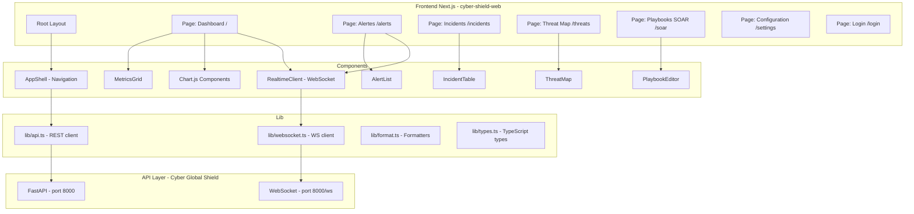

# Phase 1 — Application Web Moderne Cyber Global Shield

## Objectif
Créer une application Next.js dédiée à Cyber Global Shield avec SOC Dashboard temps réel, remplaçant les fichiers HTML statiques actuels (`dashboard.html`, `index.html`, `threat_map.html`).

## Architecture



## Pages & Routes

| Route | Page | Description | API Endpoints |
|-------|------|-------------|---------------|
| `/login` | Login | Authentification OAuth2 | `POST /api/v1/auth/login` |
| `/` | Dashboard | SOC Dashboard temps réel | `GET /api/v1/dashboard/overview`, `GET /api/v1/dashboard/alerts` |
| `/alerts` | Alertes | Liste des alertes en temps réel | `GET /api/v1/dashboard/alerts` + WebSocket |
| `/incidents` | Incidents | Gestion des incidents | `GET /api/v1/soar/playbooks` |
| `/threats` | Threat Map | Carte géographique des menaces | WebSocket events |
| `/soar` | Playbooks SOAR | Configuration visuelle des playbooks | `GET /api/v1/soar/playbooks`, `POST /api/v1/soar/execute` |
| `/settings` | Configuration | Paramètres de la plateforme | `GET /api/v1/ingest/stats` |

## Structure des Fichiers

```
apps/cyber-shield-web/
├── package.json
├── tsconfig.json
├── next.config.js
├── app/
│   ├── layout.tsx          # Root layout with metadata
│   ├── globals.css         # Global styles (dark theme SOC)
│   ├── page.tsx            # Dashboard page (SOC overview)
│   ├── login/
│   │   └── page.tsx        # Login page
│   ├── alerts/
│   │   └── page.tsx        # Real-time alerts
│   ├── incidents/
│   │   └── page.tsx        # Incident management
│   ├── threats/
│   │   └── page.tsx        # Threat map
│   ├── soar/
│   │   └── page.tsx        # SOAR playbook editor
│   └── settings/
│       └── page.tsx        # Platform settings
├── components/
│   ├── app-shell.tsx       # Navigation sidebar
│   ├── realtime-client.tsx # WebSocket client
│   ├── metrics-grid.tsx    # KPI metrics display
│   ├── alert-list.tsx      # Alert list component
│   ├── incident-table.tsx  # Incident table
│   ├── threat-map.tsx      # Threat map (Leaflet)
│   ├── playbook-editor.tsx # SOAR playbook editor
│   ├── chart-alerts.tsx    # Alerts chart (Chart.js)
│   ├── chart-threats.tsx   # Threats chart
│   └── status-badge.tsx    # Status badge component
└── lib/
    ├── api.ts              # REST API client
    ├── websocket.ts        # WebSocket client
    ├── types.ts            # TypeScript interfaces
    └── format.ts           # Formatting utilities
```

## Todo List

- [ ] **1.1** Create `apps/cyber-shield-web/` directory with package.json, tsconfig.json, next.config.js
- [ ] **1.2** Create `lib/types.ts` — All TypeScript interfaces matching the API
- [ ] **1.3** Create `lib/api.ts` — REST API client for Cyber Global Shield (port 8000)
- [ ] **1.4** Create `lib/websocket.ts` — WebSocket client for real-time events
- [ ] **1.5** Create `lib/format.ts` — Formatting utilities (dates, numbers, severity)
- [ ] **1.6** Create `app/globals.css` — Dark SOC theme with cyber aesthetic
- [ ] **1.7** Create `app/layout.tsx` — Root layout with metadata
- [ ] **1.8** Create `components/app-shell.tsx` — Navigation sidebar with all routes
- [ ] **1.9** Create `components/realtime-client.tsx` — WebSocket real-time client
- [ ] **1.10** Create `components/status-badge.tsx` — Severity/status badge component
- [ ] **1.11** Create `components/metrics-grid.tsx` — KPI metrics display grid
- [ ] **1.12** Create `components/chart-alerts.tsx` — Alerts over time chart (Chart.js)
- [ ] **1.13** Create `components/chart-threats.tsx` — Threats by type chart
- [ ] **1.14** Create `components/alert-list.tsx` — Real-time alert list
- [ ] **1.15** Create `components/incident-table.tsx` — Incident management table
- [ ] **1.16** Create `components/threat-map.tsx` — Geographic threat map (Leaflet)
- [ ] **1.17** Create `components/playbook-editor.tsx` — SOAR playbook visual editor
- [ ] **1.18** Create `app/login/page.tsx` — Login page with OAuth2 form
- [ ] **1.19** Create `app/page.tsx` — Dashboard page (SOC overview)
- [ ] **1.20** Create `app/alerts/page.tsx` — Real-time alerts page
- [ ] **1.21** Create `app/incidents/page.tsx` — Incident management page
- [ ] **1.22** Create `app/threats/page.tsx` — Threat map page
- [ ] **1.23** Create `app/soar/page.tsx` — SOAR playbook editor page
- [ ] **1.24** Create `app/settings/page.tsx` — Platform settings page
- [ ] **1.25** Update root `package.json` to include the new workspace
