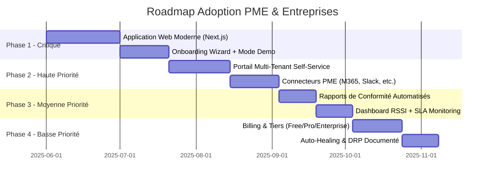

# Cyber Global Shield — Plan d'Adoption PME & Entreprises

## Analyse des Gaps pour l'Adoption par les PME et Entreprises

### Constat
La plateforme **Cyber Global Shield** est techniquement très avancée (35 modules de sécurité, ML de pointe, agents CrewAI, SOAR, quantum, federated learning, etc.). Cependant, son adoption par des PME et entreprises nécessite des investissements significatifs en **expérience utilisateur**, **déploiement simplifié**, et **intégrations prêtes à l'emploi**.

---

## Gap 1 : Interface Utilisateur Professionnelle (🔴 Critique)

**État actuel :**
- Dashboard HTML statique (900 lignes monolithiques)
- App Next.js orientée "AI Incident Layer" (autre produit)
- Pas d'interface de configuration pour les playbooks SOAR
- Pas de visualisation temps réel des alertes

**Ce qu'il faut :**
- Application web moderne dédiée à Cyber Global Shield
- SOC Dashboard temps réel avec WebSockets
- Configuration visuelle des playbooks SOAR (drag & drop)
- Rapports PDF exportables
- Mode démo / onboarding

---

## Gap 2 : Onboarding & Déploiement Simplifié (🔴 Critique)

**État actuel :**
- 15 services Docker à déployer
- Pas d'installateur one-command
- Pas de version SaaS multi-tenant
- Pas de wizard de configuration

**Ce qu'il faut :**
- Script d'installation automatisé
- Version SaaS clé en main
- Wizard de configuration par taille d'entreprise
- Documentation utilisateur complète

---

## Gap 3 : Gestion Multi-Tenant & Facturation (🟠 Haute)

**État actuel :**
- Multi-tenant implémenté dans le code (`org_id`)
- Pas de portail d'inscription self-service
- Pas de système de billing
- Pas de limitation par tier

**Ce qu'il faut :**
- Portail d'inscription self-service
- Intégration Stripe pour la facturation
- Tiers Free / Pro / Enterprise
- Quotas par tenant

---

## Gap 4 : Intégrations PME Prêtes à l'Emploi (🟠 Haute)

**État actuel :**
- Connecteurs existants : MISP, Cortex, VirusTotal, Wazuh, Fortinet
- Pas de connecteurs pour les outils PME courants

**Ce qu'il faut :**
- Microsoft 365 Defender / Sentinel
- Google Workspace
- Slack / Teams notifications
- CrowdStrike / SentinelOne EDR
- AWS / Azure / GCP native

---

## Gap 5 : Conformité & Rapports (🟡 Moyenne)

**État actuel :**
- Pas de rapports de conformité automatisés
- Pas de vue RSSI

**Ce qu'il faut :**
- Rapports ISO 27001, SOC 2, GDPR, NIST, PCI-DSS
- Audit trail exportable
- SLA monitoring
- Dashboard RSSI

---

## Gap 6 : Support & Maintenance (🟢 Basse)

**État actuel :**
- Pas de healthcheck global consolidé
- Pas d'auto-réparation
- Pas de canal de support intégré

**Ce qu'il faut :**
- Healthcheck global unifié
- Auto-healing pour défaillances courantes
- Chat in-app / ticketing
- Mise à jour automatique des modèles ML

---

## Gap 7 : Sécurité & Résilience Production (🟢 Basse)

**État actuel :**
- Backup ClickHouse seulement
- Pas de DRP documenté
- Rate limiting global seulement

**Ce qu'il faut :**
- Backup automatisé de la configuration
- Disaster Recovery Plan
- Rate limiting par tenant
- WAF intégré

---

## Plan d'Action par Phase

## Architecture Cible

```mermaid
graph TB
    subgraph "Frontend"
        WEB[Next.js App - Cyber Global Shield]
        DASH[SOC Dashboard Temps Réel]
        WIZ[Onboarding Wizard]
        CONF[Configuration Visuelle SOAR]
    end

    subgraph "API Layer"
        API[FastAPI - app.py]
        WS[WebSocket Manager]
        AUTH[Auth Multi-Tenant]
        RATE[Rate Limiting par Tenant]
    end

    subgraph "Core Platform"
        ML[ML Modules - 35+]
        SOAR[SOAR Playbook Engine]
        AGENTS[CrewAI Agents]
        FL[Federated Learning]
    end

    subgraph "Integrations PME"
        M365[Microsoft 365 Defender]
        GW[Google Workspace]
        SLACK[Slack / Teams]
        EDR[CrowdStrike / SentinelOne]
        CLOUD[AWS / Azure / GCP]
    end

    subgraph "Billing & Tenant"
        STRIPE[Stripe Billing]
        TIER[Tier Management]
        QUOTA[Quota Enforcement]
    end

    subgraph "Compliance & Reports"
        ISO[ISO 27001 Reports]
        SOC2[SOC 2 Reports]
        GDPR[GDPR Reports]
        RSSI[RSSI Dashboard]
    end

    WEB --> API
    DASH --> WS
    WIZ --> API
    CONF --> SOAR
    API --> ML
    API --> SOAR
    API --> AGENTS
    API --> FL
    API --> M365
    API --> GW
    API --> SLACK
    API --> EDR
    API --> CLOUD
    API --> STRIPE
    API --> TIER
    TIER --> QUOTA
    API --> ISO
    API --> SOC2
    API --> GDPR
    API --> RSSI
    AUTH --> TIER
    RATE --> QUOTA
```

## Todo List pour Implémentation

- [ ] **P1.1** Créer l'application Next.js dédiée à Cyber Global Shield
- [ ] **P1.2** Implémenter le SOC Dashboard temps réel avec WebSockets
- [ ] **P1.3** Créer le wizard d'onboarding (choix des modules par taille d'entreprise)
- [ ] **P1.4** Ajouter le mode démo avec données synthétiques
- [ ] **P2.1** Développer le portail d'inscription self-service multi-tenant
- [ ] **P2.2** Implémenter les connecteurs Microsoft 365 Defender
- [ ] **P2.3** Implémenter les connecteurs Google Workspace
- [ ] **P2.4** Intégrer Slack / Teams pour les notifications
- [ ] **P2.5** Ajouter les connecteurs EDR (CrowdStrike, SentinelOne)
- [ ] **P3.1** Créer les templates de rapports de conformité (ISO 27001, SOC 2, GDPR)
- [ ] **P3.2** Développer le dashboard RSSI avec SLA monitoring
- [ ] **P4.1** Intégrer Stripe pour la facturation
- [ ] **P4.2** Implémenter les tiers Free / Pro / Enterprise avec quotas
- [ ] **P4.3** Documenter le Disaster Recovery Plan
- [ ] **P4.4** Implémenter l'auto-healing pour les services critiques
