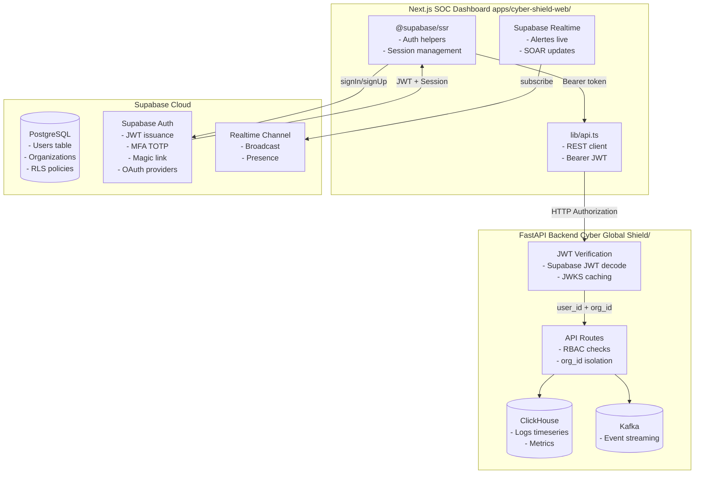
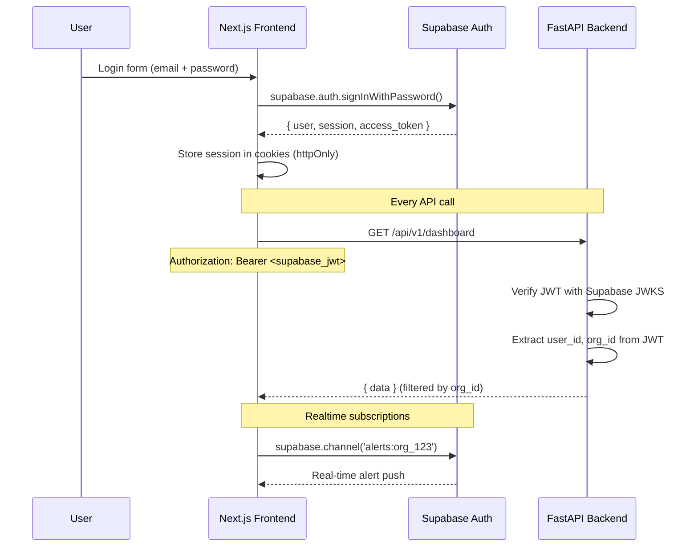

# Plan d'Intégration Supabase (DB + Auth) pour Cyber Global Shield

## Architecture cible



## Phases d'implémentation

### Phase 1 : Configuration Supabase (projet + clés)

- [ ] Créer un projet Supabase (via dashboard.supabase.com)
- [ ] Récupérer `SUPABASE_URL`, `SUPABASE_ANON_KEY`, `SUPABASE_SERVICE_ROLE_KEY`
- [ ] Configurer les Auth providers (Email/Password, Google, GitHub)
- [ ] Activer MFA (TOTP) dans Auth settings
- [ ] Configurer les Rate Limiting rules

### Phase 2 : Backend FastAPI — Vérification JWT Supabase

- [ ] Remplacer l'`AuthManager` in-memory par Supabase Admin SDK
- [ ] Ajouter `supabase-py` aux dépendances
- [ ] Créer `app/core/supabase_client.py` — Client Supabase singleton
- [ ] Modifier `app/core/auth.py` — Vérifier les JWT Supabase avec JWKS
- [ ] Modifier `app/routes/auth.py` — Déléguer à Supabase Auth
- [ ] Ajouter middleware de vérification de session Supabase

### Phase 3 : Base de données — Migration PostgreSQL

- [ ] Créer les tables dans Supabase PostgreSQL :
  - `organizations` (id, name, tier, settings, created_at)
  - `profiles` (id, user_id, org_id, role, permissions)
  - `api_keys` (id, key_hash, user_id, org_id, expires_at)
- [ ] Configurer Row Level Security (RLS) sur chaque table
- [ ] Créer les policies RLS par `org_id`
- [ ] Migrer les données existantes (si applicable)

### Phase 4 : Frontend Next.js — Supabase Auth

- [ ] Installer `@supabase/supabase-js` et `@supabase/ssr`
- [ ] Créer `lib/supabase/client.ts` — Client navigateur
- [ ] Créer `lib/supabase/server.ts` — Client serveur (SSR)
- [ ] Remplacer `app/login/page.tsx` — Utiliser Supabase Auth UI
- [ ] Ajouter middleware Next.js pour protection des routes
- [ ] Gérer le refresh token automatique

### Phase 5 : Realtime — Alertes en direct

- [ ] Remplacer le WebSocket custom par Supabase Realtime
- [ ] Créer les channels Realtime pour :
  - `alerts:{org_id}` — Alertes en direct
  - `soar:{org_id}` — Mises à jour SOAR
  - `system:{org_id}` — Notifications système
- [ ] Modifier `components/realtime-client.tsx` — Utiliser Supabase Realtime

### Phase 6 : Row Level Security — Multi-tenant

- [ ] Activer RLS sur toutes les tables
- [ ] Créer policies de base :
  ```sql
  -- Users can only see their org's data
  CREATE POLICY org_isolation ON alerts
    USING (org_id = auth.jwt() ->> 'org_id');
  
  -- Admins can see all
  CREATE POLICY admin_access ON alerts
    USING (auth.jwt() ->> 'role' = 'admin');
  ```
- [ ] Tester l'isolation entre organisations

## Fichiers à modifier

### Backend (FastAPI)

| Fichier | Modification |
|---------|-------------|
| `app/core/config.py` | Ajouter `SUPABASE_SERVICE_ROLE_KEY`, `SUPABASE_JWKS_URL` |
| `app/core/supabase_client.py` | **NOUVEAU** — Client Supabase Admin |
| `app/core/auth.py` | Remplacer `AuthManager` in-memory par vérification JWT Supabase |
| `app/core/database.py` | Simplifier — Supabase URL uniquement, plus de fallback SQLite |
| `app/routes/auth.py` | Déléguer login/register à Supabase Auth |
| `app/core/middleware.py` | Ajouter vérification de session Supabase |
| `requirements.txt` | Ajouter `supabase>=2.0.0` |

### Frontend (Next.js)

| Fichier | Modification |
|---------|-------------|
| `apps/cyber-shield-web/package.json` | Ajouter `@supabase/supabase-js`, `@supabase/ssr` |
| `apps/cyber-shield-web/lib/supabase/client.ts` | **NOUVEAU** — Client navigateur |
| `apps/cyber-shield-web/lib/supabase/server.ts` | **NOUVEAU** — Client serveur |
| `apps/cyber-shield-web/lib/api.ts` | Utiliser le token Supabase comme Bearer |
| `apps/cyber-shield-web/lib/websocket.ts` | Remplacer par Supabase Realtime |
| `apps/cyber-shield-web/app/login/page.tsx` | Utiliser `supabase.auth.signInWithPassword()` |
| `apps/cyber-shield-web/app/layout.tsx` | Ajouter `SupabaseListener` pour session |
| `apps/cyber-shield-web/components/realtime-client.tsx` | Utiliser Supabase Realtime channels |
| `apps/cyber-shield-web/middleware.ts` | **NOUVEAU** — Protection des routes |

## Variables d'environnement

### Backend (.env)
```env
SUPABASE_URL=https://xxxxx.supabase.co
SUPABASE_ANON_KEY=eyJhbGciOiJIUzI1NiIs...
SUPABASE_SERVICE_ROLE_KEY=eyJhbGciOiJIUzI1NiIs...
SUPABASE_JWT_SECRET=your-jwt-secret-here
```

### Frontend (.env.local)
```env
NEXT_PUBLIC_SUPABASE_URL=https://xxxxx.supabase.co
NEXT_PUBLIC_SUPABASE_ANON_KEY=eyJhbGciOiJIUzI1NiIs...
```

## Schéma PostgreSQL (Supabase)

```sql
-- Organizations table
CREATE TABLE organizations (
  id UUID PRIMARY KEY DEFAULT gen_random_uuid(),
  name TEXT NOT NULL,
  slug TEXT UNIQUE NOT NULL,
  tier TEXT DEFAULT 'free' CHECK (tier IN ('free', 'starter', 'business', 'enterprise')),
  settings JSONB DEFAULT '{}',
  created_at TIMESTAMPTZ DEFAULT now(),
  updated_at TIMESTAMPTZ DEFAULT now()
);

-- Profiles (extends Supabase auth.users)
CREATE TABLE profiles (
  id UUID PRIMARY KEY REFERENCES auth.users(id) ON DELETE CASCADE,
  org_id UUID REFERENCES organizations(id) ON DELETE SET NULL,
  full_name TEXT,
  avatar_url TEXT,
  role TEXT DEFAULT 'analyst' CHECK (role IN ('admin', 'soc_engineer', 'analyst', 'viewer')),
  permissions TEXT[] DEFAULT '{}',
  is_active BOOLEAN DEFAULT true,
  created_at TIMESTAMPTZ DEFAULT now(),
  updated_at TIMESTAMPTZ DEFAULT now()
);

-- Enable RLS
ALTER TABLE organizations ENABLE ROW LEVEL SECURITY;
ALTER TABLE profiles ENABLE ROW LEVEL SECURITY;

-- RLS Policies
CREATE POLICY "Users can view their own organization"
  ON organizations FOR SELECT
  USING (id IN (
    SELECT org_id FROM profiles WHERE id = auth.uid()
  ));

CREATE POLICY "Users can view profiles in their org"
  ON profiles FOR SELECT
  USING (org_id IN (
    SELECT org_id FROM profiles WHERE id = auth.uid()
  ));
```

## Flux d'authentification



## Notes importantes

1. **Sécurité** : Le `SUPABASE_SERVICE_ROLE_KEY` ne doit JAMAIS être exposé côté client
2. **JWT** : Supabase utilise des JWTs standards — vérifiables avec n'importe quelle lib JWT
3. **RLS** : La sécurité multi-tenant repose sur RLS — chaque requête SQL est filtrée par `org_id`
4. **ClickHouse** : Reste la base de données principale pour les logs/timeseries — Supabase PostgreSQL est pour les métadonnées (users, orgs, config)
5. **Kafka** : Reste inchangé pour le streaming d'événements
